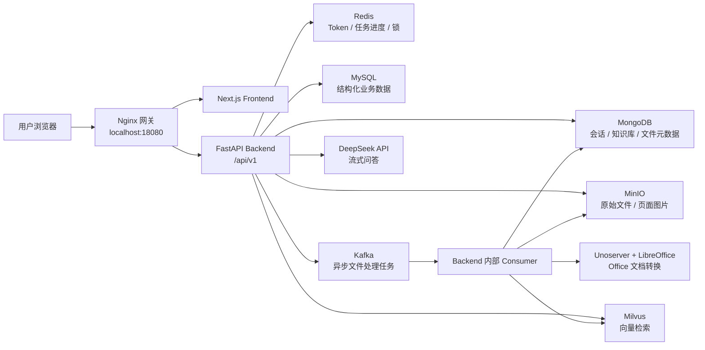
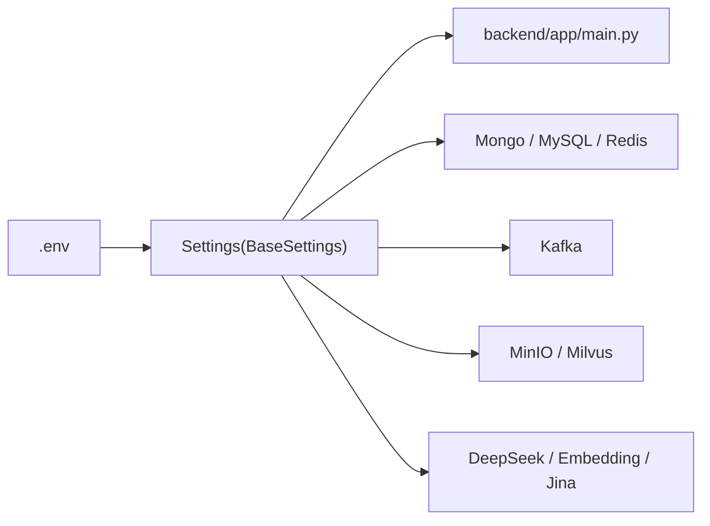
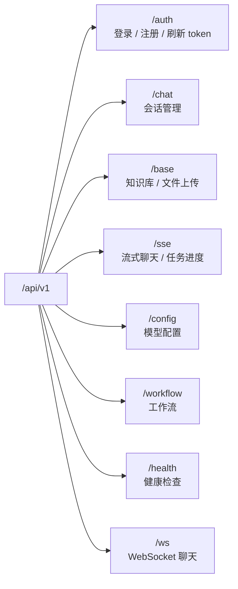

# Day 1 系统入口、配置与服务拓扑

第一天先不要急着看每个业务函数。你要先建立全局地图，知道系统由哪些服务组成、配置从哪里来、请求从哪里进入。

今天结束后，你应该能回答三个问题：

1. 这个系统由哪些容器和中间件组成？
2. FastAPI 后端启动时初始化了哪些资源？
3. 一个请求进入系统后，会从哪个路由模块进入业务代码？

---

## 1. 推荐阅读顺序

```text
docker-compose-no-local-embedding.yml
  ↓
backend/app/core/config.py
  ↓
backend/app/main.py
  ↓
backend/app/api/__init__.py
```

这四个文件分别回答：

| 文件 | 解决的问题 |
| --- | --- |
| `docker-compose-no-local-embedding.yml` | 系统有哪些服务，每个服务怎么连 |
| `backend/app/core/config.py` | `.env` 里的配置如何进入代码 |
| `backend/app/main.py` | FastAPI 启动时初始化什么 |
| `backend/app/api/__init__.py` | API 路由如何组织 |

---

## 2. 一图理解系统组成



可以把系统拆成三层：

| 层级 | 服务 | 作用 |
| --- | --- | --- |
| 接入层 | `nginx`、`frontend`、`backend` | 页面访问、API 网关、业务接口 |
| 数据与中间件层 | `redis`、`mongodb`、`mysql`、`minio`、`kafka`、`milvus` | 状态、元数据、对象存储、异步任务、向量检索 |
| 文档与模型层 | `unoserver`、Embedding、DeepSeek API | 文档转换、向量化、大模型问答 |

---

## 3. Docker Compose 服务职责

| 服务 | 主要职责 | 面试表达 |
| --- | --- | --- |
| `nginx` | 暴露 `18080:80`，统一转发前端页面和后端 API | 统一入口，避免暴露多个内部服务端口 |
| `frontend` | Next.js 前端页面 | 用户操作入口 |
| `backend` | FastAPI 主服务 | 认证、知识库、上传、聊天、Kafka Consumer |
| `kafka` | 消息队列 | 解耦上传和文档解析 |
| `kafka-init` | 初始化 Kafka topic | 容器启动时自动准备消息主题 |
| `minio` | 对象存储 | 保存原始文件和解析后的页面图片 |
| `mongodb` | 文档数据库 | 保存知识库、文件、页面、会话等元数据 |
| `mysql` | 关系型数据库 | 保存部分结构化业务数据 |
| `redis` | 缓存和状态 | 保存 token、任务进度、锁 |
| `milvus-standalone` | 向量数据库 | 保存 embedding，执行 Top-K 检索 |
| `milvus-etcd` | Milvus 依赖 | 保存 Milvus 元数据 |
| `milvus-minio` | Milvus 依赖 | 保存 Milvus 内部对象数据 |
| `unoserver` | 文档转换 | 调用 LibreOffice 转换 Office 文档 |
| `python-sandbox` | 工作流沙箱 | 支持工作流代码节点执行 |

本地推荐使用轻量 compose：

```powershell
docker compose -f docker-compose-no-local-embedding.yml up -d --build
```

如果需要 Office 文档转换：

```powershell
docker compose -f docker-compose-no-local-embedding.yml --profile document-convert up -d --build
```

---

## 4. 配置中心：`.env` 如何进入代码

后端配置集中在：

```text
backend/app/core/config.py
```

它通过 `pydantic-settings` 读取 `.env`，然后在代码里通过 `settings` 使用。



你要特别注意：

```text
.env 是本地真实配置，不应该提交到 GitHub。
.env.example 是示例配置，可以提交，但只能放占位符。
```

---

## 5. FastAPI 启动流程

后端入口：

```text
backend/app/main.py
```

启动时大致做这些事：

```text
加载 settings
  ↓
创建 FastAPI app
  ↓
注册 CORS
  ↓
注册 API router
  ↓
连接 MongoDB
  ↓
启动 Kafka Producer
  ↓
初始化 MinIO bucket
  ↓
启动 Kafka Consumer 后台任务
```

面试表达：

> 我把后端启动理解为一个资源编排过程。FastAPI 启动时会加载配置，初始化 MongoDB、MinIO、Kafka Producer，并启动 Kafka Consumer 作为后台任务；关闭时再统一释放连接，避免容器重启时出现资源残留。

---

## 6. API 路由总览

路由集中注册在：

```text
backend/app/api/__init__.py
```

可以这样理解：



| 路由 | 文件 | 第一阶段需要知道 |
| --- | --- | --- |
| `/auth` | `backend/app/api/endpoints/auth.py` | 用户认证入口 |
| `/base` | `backend/app/api/endpoints/base.py` | 知识库和文件上传入口 |
| `/chat` | `backend/app/api/endpoints/chat.py` | 会话 CRUD 和模型配置保存 |
| `/sse` | `backend/app/api/endpoints/sse.py` | SSE 流式问答和任务进度 |
| `/ws` | `backend/app/api/endpoints/ws_chat.py` | WebSocket 流式问答 |
| `/config` | `backend/app/api/endpoints/config.py` | 模型配置管理 |
| `/health` | `backend/app/api/endpoints/health.py` | 容器健康检查 |

第一天不需要深入每个 endpoint。只要知道“哪个业务从哪个入口进来”即可。

---

## 7. 今天的面试版总结

> 这个项目采用 Docker Compose 编排前端、后端、MinIO、Redis、Kafka、Milvus、MongoDB、MySQL 和 unoserver 等服务。Nginx 暴露统一入口，FastAPI 作为业务中枢，负责认证、知识库、上传和聊天接口。配置通过 `.env` 进入 `settings`，启动时初始化数据库、对象存储和 Kafka，并启动后台 Consumer。后续文档上传和 RAG 问答都基于这些基础设施展开。

---

## 8. 自查清单

- 我能说出每个核心容器的职责。
- 我知道 `.env` 和 `.env.example` 的区别。
- 我知道后端入口是 `backend/app/main.py`。
- 我知道 API 路由集中注册在 `backend/app/api/__init__.py`。
- 我能解释为什么 Nginx 是统一访问入口。
- 我知道 Kafka、MinIO、Milvus、Redis 分别解决什么问题。
