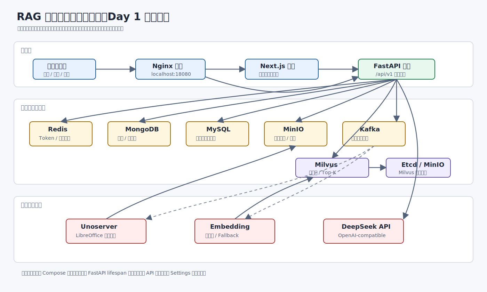
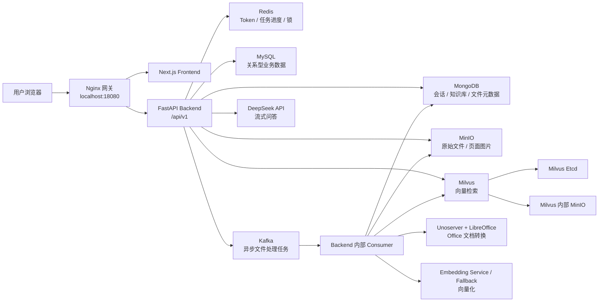
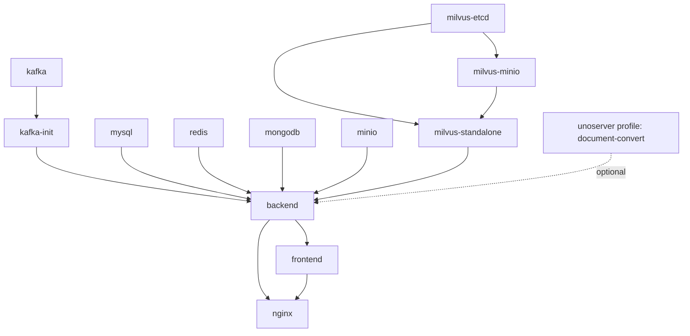
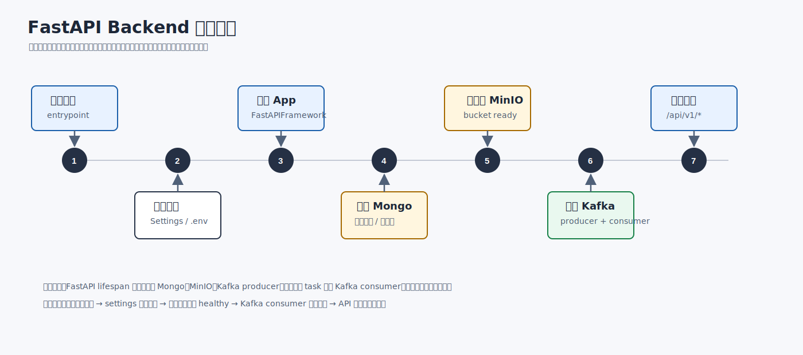
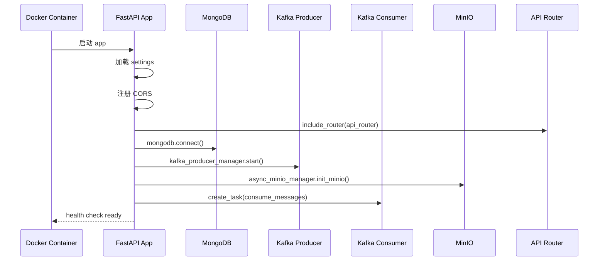
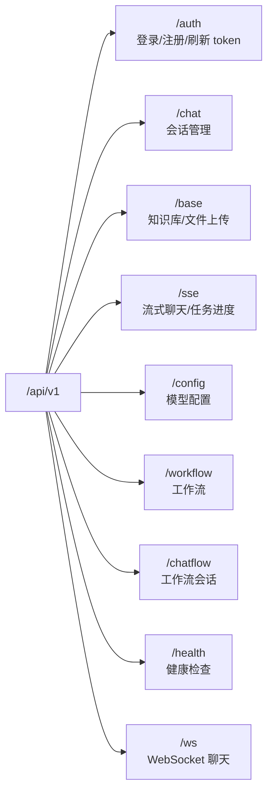
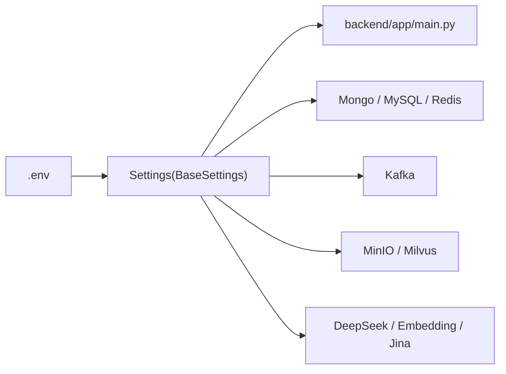

# Day 1 系统入口、配置与服务拓扑

本文档用于完成第一天学习目标：**先建立项目全局地图，再进入代码细节**。  
今天不追求读懂每一行代码，而是要能回答三个问题：

1. 这个系统由哪些服务组成？
2. FastAPI 后端启动时初始化了哪些资源？
3. 一个请求进入系统后，会从哪个入口进入业务代码？

掌握这三个问题后，后续再看“文档上传链路”“RAG 问答链路”“多租户权限隔离”会轻松很多。



---

## 1. 今日学习目标

| 学习模块 | 目标 | 需要重点阅读的文件 |
| --- | --- | --- |
| Docker 服务拓扑 | 知道系统有哪些容器，每个容器负责什么 | `docker-compose-no-local-embedding.yml` |
| 后端启动入口 | 知道 FastAPI 启动时连接了哪些基础设施 | `backend/app/main.py` |
| API 路由总览 | 知道接口按哪些业务模块拆分 | `backend/app/api/__init__.py` |
| 配置中心 | 知道 `.env` 如何进入代码 | `backend/app/core/config.py` |

建议顺序：

```text
docker-compose-no-local-embedding.yml
        ↓
backend/app/core/config.py
        ↓
backend/app/main.py
        ↓
backend/app/api/__init__.py
```

---

## 2. 一图看懂系统



这个图可以拆成三层理解：

| 层级 | 服务 | 作用 |
| --- | --- | --- |
| 接入层 | `nginx`、`frontend`、`backend` | 页面访问、API 网关、业务接口 |
| 数据与中间件层 | `redis`、`mongodb`、`mysql`、`minio`、`kafka`、`milvus` | 状态、元数据、对象存储、异步任务、向量检索 |
| 文档与模型层 | `unoserver`、`embedding`、`DeepSeek API` | 文档转换、向量化、大模型问答 |

---

## 3. Docker Compose 服务拓扑

当前推荐本地启动文件是：

```powershell
docker compose -f docker-compose-no-local-embedding.yml --profile document-convert up -d --no-build
```

该 compose 文件体现了项目的企业级工程特征：**每个能力独立容器化，通过内部网络 `daziknow-net` 通信**。

### 3.1 服务职责表

| 服务名 | 类型 | 核心职责 | 面试表达 |
| --- | --- | --- | --- |
| `nginx` | 网关 | 暴露 `18080:80`，统一转发前端页面和后端 API | 统一入口，避免直接暴露多个服务端口 |
| `frontend` | 前端 | Next.js 页面，负责知识库配置、文件上传、聊天交互 | 用户操作入口 |
| `backend` | 后端 | FastAPI 主服务，负责认证、知识库、聊天、SSE/WebSocket、Kafka consumer | 系统业务中枢 |
| `kafka` | 消息队列 | 接收文件处理任务 | 解耦上传与解析，避免大文件阻塞接口 |
| `kafka-init` | 初始化任务 | 创建 Kafka topic | 容器启动时自动准备消息主题 |
| `minio` | 对象存储 | 保存用户上传的原始文件和解析后的页面图片 | 大文件不直接塞进数据库 |
| `mongodb` | 文档数据库 | 保存知识库、文件、图片页、会话 turn 等元数据 | 适合嵌套结构和会话记录 |
| `mysql` | 关系数据库 | 保存部分关系型业务数据 | 保留传统结构化数据能力 |
| `redis` | 缓存/状态 | 保存 token 状态、任务进度、锁 | 高频短生命周期数据 |
| `milvus-standalone` | 向量数据库 | 保存 embedding 向量，执行 Top-K 检索 | RAG 召回核心 |
| `milvus-etcd` | Milvus 依赖 | 保存 Milvus 元数据 | Milvus 基础组件 |
| `milvus-minio` | Milvus 依赖 | 保存 Milvus 内部对象数据 | Milvus 基础组件 |
| `unoserver` | 文档转换 | 调用 LibreOffice 将 doc/docx/ppt 等转为 PDF/图片 | 支持企业常见 Office 文档 |
| `python-sandbox` | 执行沙箱 | 工作流代码节点执行环境 | 支持工作流扩展 |

### 3.2 依赖关系



这里要注意两个点：

1. `backend` 不直接映射宿主机端口，外部主要通过 `nginx:18080` 访问。
2. `unoserver` 使用 `document-convert` profile，不是所有场景都必须启动，但处理 Office 文档时很重要。

---

## 4. 后端启动流程

后端入口是 `backend/app/main.py`。  
这个文件的核心不是业务逻辑，而是**应用生命周期管理**。





### 4.1 启动时初始化了什么

| 初始化对象 | 代码位置 | 作用 |
| --- | --- | --- |
| `settings` | `backend/app/core/config.py` | 从 `.env` 读取配置 |
| `FastAPIFramework` | `backend/app/main.py` | 创建 FastAPI app |
| CORS | `backend/app/main.py` | 允许前端访问后端 API |
| MongoDB | `mongodb.connect()` | 准备会话、知识库、文件元数据存储 |
| Kafka Producer | `kafka_producer_manager.start()` | 准备发送文件处理任务 |
| MinIO | `async_minio_manager.init_minio()` | 准备对象存储 bucket |
| Kafka Consumer | `kafka_consumer_manager.consume_messages()` | 后台消费文件处理任务 |
| API Router | `framework.include_router(api_router)` | 注册所有业务接口 |

### 4.2 关闭时释放了什么

系统关闭时会执行：

| 释放对象 | 意义 |
| --- | --- |
| Kafka consumer | 停止消费后台任务 |
| Kafka producer | 关闭 producer 连接 |
| MySQL | 关闭连接池 |
| MongoDB | 关闭 Mongo client |
| Redis | 关闭 Redis 连接 |

面试时可以这样讲：

> 我把后端启动理解为一个资源编排过程。FastAPI lifespan 里会初始化 Mongo、MinIO、Kafka producer，并启动 Kafka consumer 后台任务；关闭时再统一释放连接，避免容器重启时出现僵尸连接或任务残留。

---

## 5. API 路由总览

路由集中注册在 `backend/app/api/__init__.py`。



| 路由前缀 | 文件 | 第一阶段只需要知道 |
| --- | --- | --- |
| `/auth` | `backend/app/api/endpoints/auth.py` | 用户认证入口 |
| `/base` | `backend/app/api/endpoints/base.py` | 知识库和文件上传入口 |
| `/chat` | `backend/app/api/endpoints/chat.py` | 会话 CRUD 和模型配置保存 |
| `/sse` | `backend/app/api/endpoints/sse.py` | SSE 流式问答和任务进度 |
| `/ws` | `backend/app/api/endpoints/ws_chat.py` | WebSocket 流式问答 |
| `/config` | `backend/app/api/endpoints/config.py` | 模型配置管理 |
| `/health` | `backend/app/api/endpoints/health.py` | 容器健康检查 |

第一天不要深入每个 endpoint。只要知道**哪个业务从哪个入口进来**即可。

---

## 6. 配置中心：Settings 与 `.env`

后端配置集中在 `backend/app/core/config.py`，通过 `pydantic-settings` 的 `BaseSettings` 自动读取 `.env`。



### 6.1 配置分类

| 分类 | 关键配置 | 作用 |
| --- | --- | --- |
| API | `API_VERSION_URL` | 默认 `/api/v1` |
| 日志 | `LOG_LEVEL` | 控制日志级别 |
| MySQL | `DB_URL`、`DB_POOL_SIZE` | 关系数据库连接 |
| Redis | `REDIS_URL`、`REDIS_TOKEN_DB`、`REDIS_TASK_DB`、`REDIS_LOCK_DB` | token、任务、锁分库 |
| JWT | `SECRET_KEY`、`ALGORITHM`、`ACCESS_TOKEN_EXPIRE_MINUTES` | 登录态安全 |
| MongoDB | `MONGODB_URL`、`MONGODB_DB` | 文档元数据存储 |
| Kafka | `KAFKA_BROKER_URL`、`KAFKA_TOPIC`、`KAFKA_GROUP_ID` | 异步处理链路 |
| MinIO | `MINIO_URL`、`MINIO_BUCKET_NAME` | 文件对象存储 |
| Milvus | `MILVUS_URI` | 向量数据库 |
| Unoserver | `UNOSERVER_HOST`、`UNOSERVER_BASE_PORT` | Office 文档转换 |
| Embedding | `EMBEDDING_MODEL`、`EMBEDDING_FALLBACK_ENABLED` | 向量化策略 |
| DeepSeek | `DEEPSEEK_BASE_URL`、`DEEPSEEK_MODEL` | 大模型问答 |

### 6.2 安全注意点

后端启动日志会打印配置，但敏感字段需要脱敏。当前 `main.py` 中已经对以下字段做了脱敏：

```text
db_url
redis_password
secret_key
deepseek_api_key
mongodb_root_password
minio_secret_key
jina_api_key
```

面试表达：

> 配置统一从 `.env` 注入到 Settings，业务代码不直接硬编码密钥和服务地址。启动日志会输出配置快照用于排障，但密钥类字段会脱敏，避免容器日志泄漏敏感信息。

---

## 7. 第一日阅读路线

建议用下面这个节奏读代码。

### 7.1 第一轮：只看名字和结构

目标：知道项目由哪些部分组成。

```text
docker-compose-no-local-embedding.yml
backend/app/main.py
backend/app/api/__init__.py
backend/app/core/config.py
```

阅读时只标注：

| 你要找的东西 | 如何判断已经看懂 |
| --- | --- |
| 服务列表 | 能说出每个容器做什么 |
| 入口文件 | 能说出 FastAPI 启动时连了哪些服务 |
| 路由注册 | 能说出 `/auth`、`/base`、`/chat`、`/sse` 分别是什么 |
| 配置来源 | 能说出 `.env -> Settings -> 业务代码` |

### 7.2 第二轮：画自己的简图

你需要自己手写一遍这个图：

```text
Browser
  ↓
Nginx :18080
  ↓
Frontend / Backend
  ↓
MongoDB + Redis + MinIO + Kafka + Milvus
  ↓
Unoserver / Embedding / DeepSeek
```

能不看文档画出来，就说明第一天过关。

### 7.3 第三轮：补充口头表达

把下面这段练熟：

> 这个系统本地通过 Docker Compose 编排。外部访问入口是 Nginx 的 18080 端口，前端负责页面交互，后端是 FastAPI。后端启动时会初始化 MongoDB、MinIO、Kafka producer，并启动 Kafka consumer 后台任务。Redis 负责 token 和任务状态，MinIO 负责文件对象存储，Milvus 负责向量检索，Kafka 用来异步处理文档解析任务，DeepSeek 用来生成最终回答。

---

## 8. 面试官可能追问

### Q1：为什么要用这么多容器？

答：

> 因为 RAG 系统不是单一 Web 服务，它同时依赖对象存储、向量数据库、消息队列、缓存、关系数据库和文档数据库。容器化后每个基础设施独立部署、独立健康检查，方便本地复现，也方便后续拆分和扩容。

### Q2：为什么后端不直接暴露端口？

答：

> 本地通过 Nginx 作为统一入口，前端页面和后端 API 都通过同一个网关访问。这样可以减少端口暴露，后续也方便做 HTTPS、跨域、反向代理和统一鉴权策略。

### Q3：Kafka 在第一天架构图里为什么这么重要？

答：

> 文档解析和向量化属于耗时任务，如果上传接口同步处理，容易超时且用户体验差。Kafka 让上传和解析解耦，接口只负责保存文件和投递任务，后台 consumer 再慢慢处理。

### Q4：MongoDB、MinIO、Milvus 分别存什么？

答：

> MinIO 存原始文件和解析后的页面图片；MongoDB 存知识库、文件、图片页、会话等元数据；Milvus 存向量和检索所需 metadata。三者职责分离，避免把大文件、业务元数据和向量索引混在一起。

### Q5：Settings 配置中心有什么价值？

答：

> 服务地址、密钥、模型参数都通过 `.env` 注入 Settings，代码只依赖配置对象，不硬编码环境信息。这样本地、测试、生产环境可以使用不同 `.env`，部署时也更安全。

---

## 9. 今日验收清单

完成第一天学习后，你应该能做到：

- [ ] 能画出服务拓扑图。
- [ ] 能说出 `nginx`、`frontend`、`backend`、`redis`、`mongodb`、`minio`、`kafka`、`milvus` 的作用。
- [ ] 能解释 FastAPI 启动时做了哪些初始化。
- [ ] 能说出 `/api/v1/auth`、`/api/v1/base`、`/api/v1/chat`、`/api/v1/sse` 的职责。
- [ ] 能说明 `.env` 如何进入后端代码。
- [ ] 能用 1 分钟讲清楚本项目的整体架构。

---

## 10. 一分钟复述模板

你可以直接背下面这版：

> 这个项目通过 Docker Compose 编排多个服务，外部入口是 Nginx 的 18080 端口。前端是 Next.js，后端是 FastAPI，后端启动时会加载 Settings 配置，初始化 MongoDB、MinIO、Kafka producer，并启动 Kafka consumer 后台任务。系统使用 Redis 管理 token 和任务状态，MinIO 存储原始文件和解析图片，MongoDB 保存知识库和会话元数据，Kafka 解耦文件上传和异步解析，Milvus 负责向量检索，DeepSeek API 负责最终的流式问答。这种结构把接入层、业务层、存储层、异步任务层和模型层分开，便于排障和扩展。

---

## 11. 下一天预告

第二天建议学习：**认证和用户体系**。

阅读顺序：

```text
backend/app/api/endpoints/auth.py
backend/app/core/security.py
backend/app/db/redis.py
backend/app/db/mongo.py
```

第二天目标：

1. 理解登录注册流程。
2. 理解 JWT access token 和 refresh token。
3. 理解 Redis 为什么参与 token 状态管理。
4. 准备“系统如何保证接口调用者身份可信”的面试回答。
