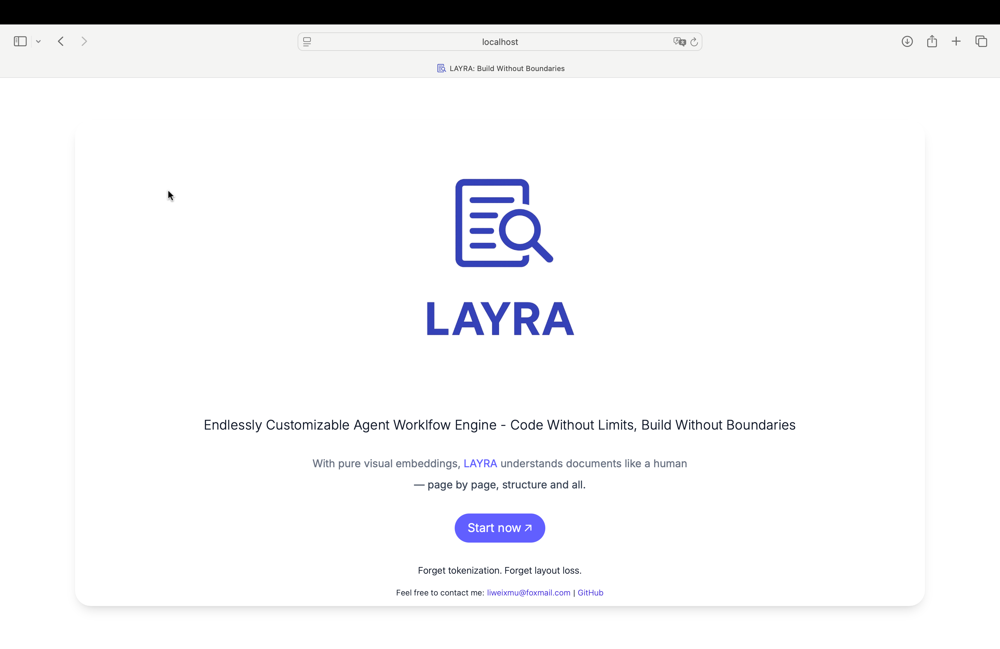

# Quick Start

Let's discover **DaziKnow in under 60 minutes** - the visual-native AI agent engine that sees, understands, and acts.

> Want to save time and effort? Join our WeChat group by scanning the [QR code](https://github.com/daziwei/daziknow/blob/main/assets/Wechat-group1.jpg) and get direct help from our developers!
>
> (If the QR code has expired, feel free to reach out to the author at daziwei@example.com.)

---

## Getting Started

Deploy DaziKnow with Docker to unlock its full visual-first RAG and Workflow capabilities:

### What You'll Need

1. **Docker** and **Docker Compose**  
   ([Installation Guide](https://docs.docker.com/engine/install/))
2. **NVIDIA GPU** with drivers and **NVIDIA Container Toolkit**  
   ([Setup Instructions](https://docs.nvidia.com/datacenter/cloud-native/container-toolkit/latest/install-guide.html))
3. 15GB+ free disk space (for AI models)

---

### Deployment Steps

##### 1. Clone Repository & Configure

```bash
git clone https://github.com/daziwei/daziknow.git
cd daziknow
vim .env  # Edit key parameters (SERVER_IP, MODEL_BASE_URL)
```

##### 2. Launch Services (First run downloads ~15GB models, be patient)

```bash
docker compose up -d --build
```

:::caution CAUTION

If you encounter issues with `docker compose`, try using `docker-compose` (with the dash) instead. Also, ensure that you're using Docker Compose v2, as older versions may not support all features. You can check your version with `docker compose version` or `docker-compose version`.

:::

##### 3. Monitor Model Weight Initialization

```bash
docker compose logs -f model-weights-init
```

> **Be patient** - Initial model download takes 20-40 mins depending on network speed. Grab a coffee!

---

### Verify Installation

1. Check running services:

After running `docker compose up -d --build`, check container status with:

```bash
docker compose ps -a
```

**Successful installation will show:**

```text
NAME                         IMAGE                                      STATUS
daziknow-backend-1              daziknow-backend                              Up (healthy)
daziknow-frontend-1             daziknow-frontend                             Up
daziknow-kafka-1                bitnami/kafka:3.8.0                        Up (healthy)
daziknow-kafka-init-1           daziknow-kafka-init                           Exited (0)
daziknow-milvus-etcd-1          quay.io/coreos/etcd:v3.5.18                Up (healthy)
daziknow-milvus-minio-1         minio/minio                                Up (healthy)
daziknow-milvus-standalone-1    milvusdb/milvus:v2.5.6                     Up (healthy)
daziknow-minio-1                minio/minio                                Up (healthy)
daziknow-model-server-1         daziknow-model-server                         Up (healthy)
daziknow-model-weights-init-1   daziknow-model-weights-init                   Exited (0)
daziknow-mongodb-1              mongo:7.0.12                               Up (healthy)
daziknow-mysql-1                mysql:9.0.1                                Up (healthy)
daziknow-nginx-1                nginx:alpine                               Up
daziknow-python-sandbox-1       python-sandbox                             Exited (0)
daziknow-redis-1                redis:7.2.5                                Up (healthy)
```

:::tip Key indicators of success

1. **10+ containers** in `Up (healthy)` status
2. **Init containers** (`kafka-init`, `model-weights-init`, `python-sandbox`) show `Exited (0)` (successful exit)
3. **No error messages** in status column
4. **Nginx** exposes port 80 (web UI access)
   :::

---

### Access Your DaziKnow Instance

Open your browser and visit:  
`http://<your-server-ip>` (Default port 80)

You should see:



---

## Troubleshooting Tips

If services fail to start:

```bash
# Check container logs:
docker compose logs <container name>
```

Common fixes:

```bash
nvidia-smi  # Verify GPU detection
docker compose down && docker compose up --build  # preserve data to rebuild
docker compose down -v && docker compose up --build  # ⚠️ delete all data to full rebuild
```

:::danger Take care

**`-v` flag**: Permanently delete all databases and model weights.

:::

### Choose the operation you need:

| **Scenario**                            | **Command**                                  | **Effect**                                 |
| --------------------------------------- | -------------------------------------------- | ------------------------------------------ |
| **Stop services** (preserve data)       | `docker compose stop`                        | Stops containers but keeps them intact     |
| **Restart after stop**                  | `docker compose start`                       | Restarts stopped containers                |
| **Rebuild after code changes**          | `docker compose up -d --build`               | Rebuilds images and recreates containers   |
| **Recreate containers** (preserve data) | `docker compose down` `docker compose up -d` | Destroys then recreates containers         |
| **Full cleanup** (delete all data)      | `docker compose down -v`                     | ⚠️ Destroys containers and deletes volumes |

:::tip Pro Tip
For faster subsequent launches, run `docker compose stop` instead of `down` to preserve models.
:::

---

> **Congratulations!** You're now running the world's first visual-native AI agent engine. 🚀

## Next Steps

1. Upload documents in **[Knowledge Base](./knowledge-base)**
2. Try visual Q&A in **[Chat](./RAG-Chat)**
3. Build agents in **[Workflow](./category/workflow)**
